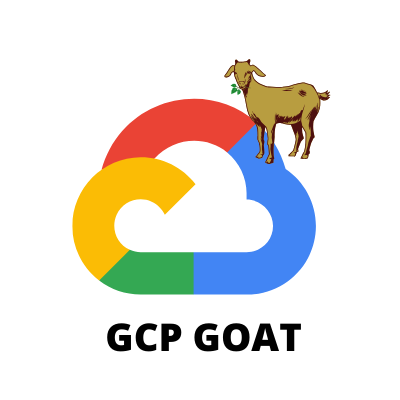

## GCP Goat

GCP-Goat is intentionally vulnerable GCP environment to learn and practice GCP Security

<div align="center">

</div>

## To run the Documentation Locally

Download the `mdbook` by following the [Guide](https://github.com/rust-lang/mdBook)

Start the Documentation by following the Guide

``` bash
cd mddocs && mdbook serve
```

## ⚠️ Disclaimer

> GCP Goat is the intentionally vulnerable GCP Setup Don't Deploy this in production Environment 


> GCP Goat comes with absolutely no warranties whatsoever. By using GCP Goat, you take full responsibility for any and all outcomes that result.
