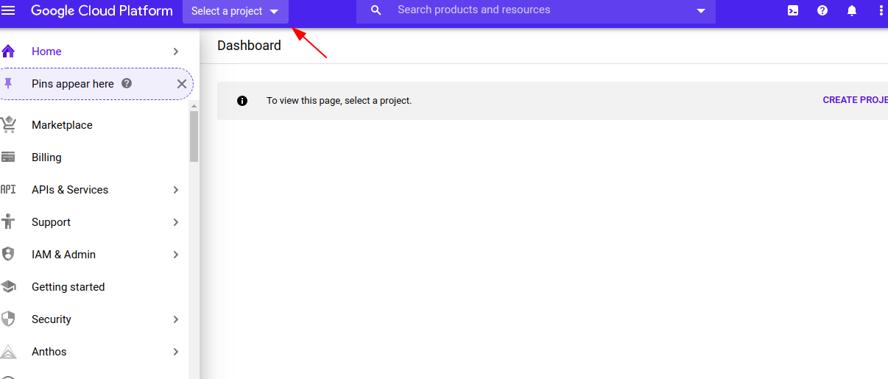
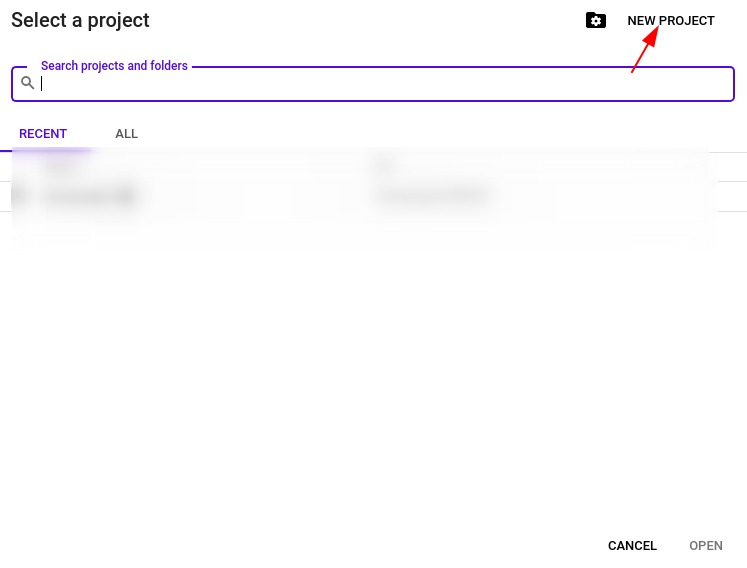
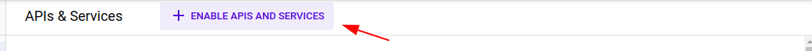
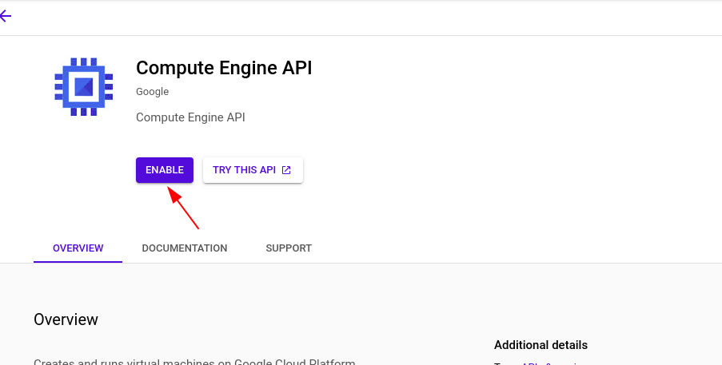
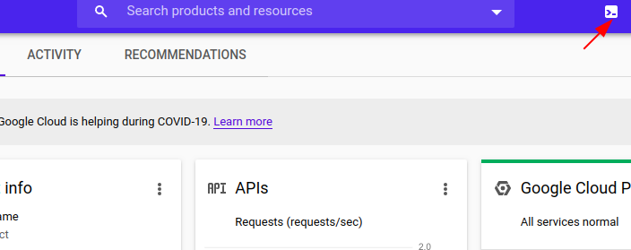
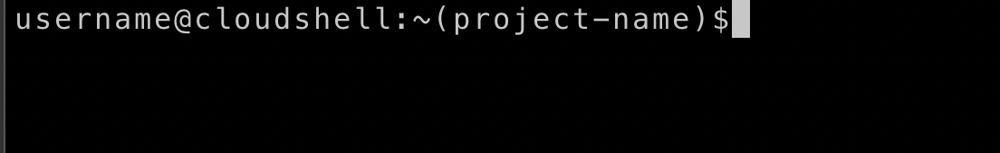

## Getting Started

This tutorial assumes that you have Google Cloud Account with Billing Enabled in order to create the resources need for the Setup

If you have don't have the Google Cloud Account Create one by following the given link [Get Started with Google Cloud Platform](https://console.cloud.google.com/getting-started)


Go to the [Google-Console](https://console.cloud.google.com)

Create the new Project by Clicking Select Project



Create the new Project by Clicking New Project 



Enter a Valid name and click Create

Go to the [API Dashboard](https://console.cloud.google.com/apis)

Click on the `ENABLE API AND SERVICES`




Search for `Compute Engine API` and click Enable




Repeat the Same for the `Kubernetes Engine API` and for the `Cloud SQL Admin API`

Once you have done Go to the GCloud Shell by clicking the `terminal` icon in top right corner




Once you are inside the `Shell`  make sure the shell points to the current project 



clone the repository by  typing the following command in the `GCLOUD SHELL`

``` bash
git clone https://github.com/JOSHUAJEBARAJ/GCP-Goat.git
```


Move into the `Scenarios` folder by typing the following command in the `GCLOUD SHELL`

``` bash
cd GCP-Goat/scenarios/
```

