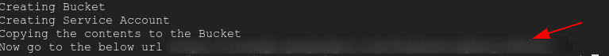
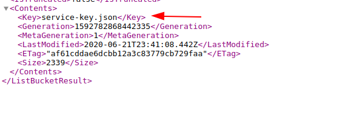
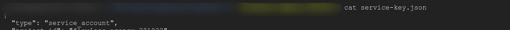

## Attacking Google Cloud Storage

In order to start the scenario go to the `scenario-4` folder by typing the below command in the `GCLOUD Shell`

``` bash
cd scenario-4
```

Start the Scenario by typing the below command in the `GCLOUD Shell` the script expects the user to give the Service name 

> Note if you try to deploy the same scenario use different service account name, because reusing same the name will create conflicts and Also make sure to use the SERVICE ACCOUNT NAME with the length between 6 and 30

``` bash
./create-scenario-4.sh <SERVICE-ACCOUNT_NAME>
```


### Scenario info

Public-Facing Google Bucket is the most common vulnerability in the `GCP` environment Users often create the bucket with public access in order to use the data stored in the bucket to be used by external application ,Sometimes this leads leakage of sensitive information

### Solution 

Go to the URL shown in the output the above script




Now open the URL in the browser On opening the URL it shows there was a file called `service-key.json`




Download the file by typing the below command in the `GCLOUD Shell`

``` bash
wget <URL>/service-key.json
```

Executing `cat` command on the `service-key.json` reveals that it was service account key 



In the next Scenario we will see how to use the  obtained key

### Clean up

To clean up the `Scenario` type the below command in the `GCLOUD Shell`

``` bash
./delete-scenario-4.sh 
```

Move into the previous folder by typing the below command in the `GCLOUD Shell`

``` bash
cd ..
```