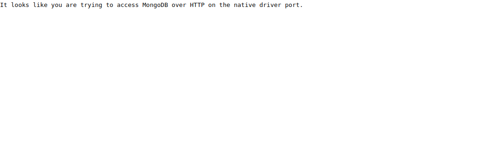
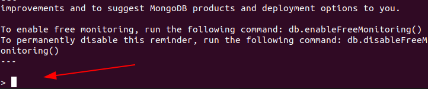

## Attacking Google Kubernetes Engine 

Inorder to start the scenario go to the `scenario-3` folder by typing the below command in the `GCLOUD SHELL`

``` bash
cd scenario-3
```

Start the Scenario by typing the below command in the `GCLOUD SHELL`

``` bash
./create-scenario-3.sh
```


> Note : It takes too long in order to setup the `kubernetes cluster` so be patient 🧘‍♂️

### Scenario info

GKE allows the user to set up the Kubernetes environment without much hassle ,By default the application running in the pod are not exposed outside world. To access the service outside the cluster there are 3 type of `services` can be use

1. NodePort
2. Loadbalancer
3. Ingress

Sometimes the application exposed via `Nodeport` may contains the sensitive information or services which meant to be used internally without authentication 

### Solution

Type the below command  the in the `GCLOUD SHELL` to find the IP of nodes


``` bash
kubectl get nodes -o wide
```

Now go to the browser and enter the below URL

```
<NODE-IP>:30003
```




This reveals that the MongoDB service running on the node 


Now similar to `MySQL` we will try to connect to the `MongoDB` database remotely

To connect from the mongo remotely we have to install MongoDB If you don't have `MongoDB` Installed you can easily Install by following [Official Docs](https://docs.mongodb.com/manual/installation/) 

Now try to connect to the remote instance by typing the below command in the terminal

``` bash
mongo --host <ip>:30003
```



You could see we get the shell access to `mongo-db` instance

If you are interested more on the `Kubernetes` I highly recommend to check out [Kubernetes-Goat](https://madhuakula.com/kubernetes-goat)


### Clean up

To clean up the `Scenario` type the below command in the `GCLOUD SHELL`

``` bash
./delete-scenario-3.sh 
```

Move into the previous folder by typing the below command in the `GCLOUD SHELL`

``` bash
cd ..
```
