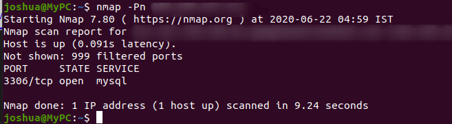
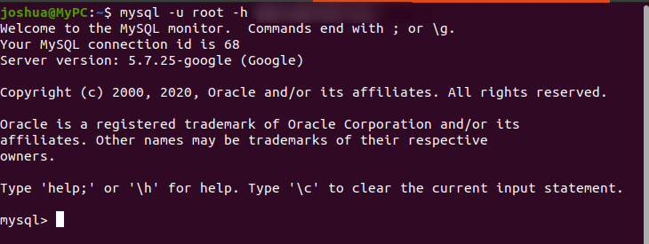

##  Attacking SQL Instance

In order to start the scenario go to the `scenario-2` folder by typing the below  command in the `GCLOUD Shell`

``` bash
cd scenario-2
```

Start the Scenario by typing the below command in the `GCLOUD Shell` the script expects the user to give the name 

> Note if you try to deploy the same scenario  create with the different name because reusing the same name will create conflicts

``` bash
./create-scenario-2.sh <SQL INSTANCE NAME>
```

> Note : It takes too long  to create the `instance` so be patient 🧘‍♂️


### Scenario info

Google SQL allows developers to set up the database without any hassle by default the database can be accessed only within the authorized network but during debugging the database sometimes the user may open the database to the public for easy debugging In this Scenario the attacker gets to know to about the public-facing SQL Instance

### Solution 

Running `Nmap` Scan on the IP reveals that `MySQL` service  was running on the given instance



In order to get remote access to the instance `MySQL client` has to be Installed

We can easily Install the `MYSQL-client` by following the [offical docs](https://dev.mysql.com/doc/refman/8.0/en/installing.html)


Now type the below command in the terminal  to connect to the remote SQL instance running in the Google Cloud


```
mysql -u root -h <ip>
```


> Note This scenario assumes there was no authentication for the  database , but in real world may  find some weak credentials 
### Clean up

To clean up the `Scenario` type the below  command in the `GCLOUD Shell`


``` bash
./delete-scenario-2.sh <SQL INSTANCE NAME>
```

Move into the previous folder by typing the below command in the `GCLOUD Shell`

``` bash
cd ..
```