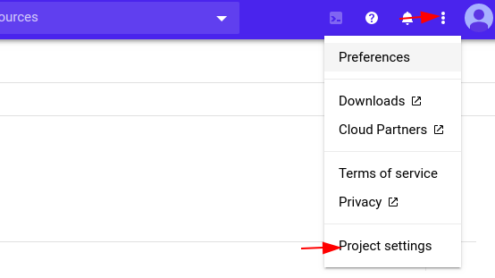
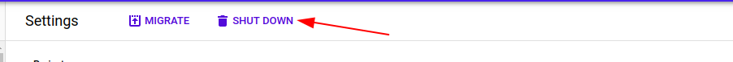

## Wrapping Up

When You Done with playing with `GCP Goat` It is adviceable to delete the project

In order Delete the project click 3 dots and top right corner and select project Setting

Click on the Shutdown Icon and 

Enter the `project-id` in the input-field and click `ShutDown`

