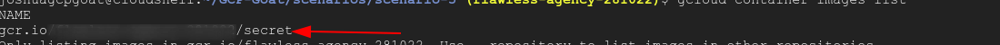
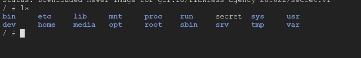
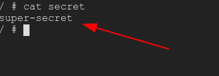

##  Privilege escalation Using Service account

> Note This scenario was based on the previous scenario So before continuing this scenario please make sure that you have completed the previous one 

Inorder to start the scenario go to the `scenario-5` folder by typing the below command in the  `GCloud Shell`

``` bash
cd scenario-5
```
Start the Scenario by typing the below command in the  `GCloud Shell`

``` bash
./create-scenario-5.sh
```

### Scenario Info

Google Container Registry Allows to store our container Registry Google Container Registry uses `Google Storage Bucket` to store the image So anyone with admin access to the bucket can download the image

### Scenario Solution

In order to get access to the bucket, we are going to use `Service-Account-Key` that we obtain in the previous scenario

Before proceeding with the scenario copy the key from the scenario-4 directory to the current directory by typing the below command

``` bash
cd ..
cp scenario-4/service-key.json scenario-5/service-key.json
cd scenario-5
```

Now activate the service account using the key by typing the below command in the  `GCloud Shell`


``` bash
gcloud auth activate-service-account --key-file=service-key.json

```

Now list the container stored in Google Container Registry by typing the below  command in the  `GCloud Shell`

``` bash
gcloud container images list
```




Now download and run the container by typing the below command in the  `GCloud Shell`

```  bash
docker run  --rm  -ti  gcr.io/<project-name>/secret:v1 sh
```

> make sure to add the tag in the Container Name The name should be in the format of gcr.io/<project-name>/secret:v1

On listing down the file container using `ls` command there was a file called `secret`




Now perform `cat` on the file  to see the content on the File



Get out of the container shell by typing `exit` in the shell

### Clean up

Before cleaning the scenario switch back to the original account by typing below command in the  `GCloud Shell`


``` bash
 gcloud config set account <email>

```

To clean up the `Scenario` type the below command in the  `GCloud Shell`

> Note this name should be the same name that we used to create the scenario-4

``` bash
./delete-scenario-5.sh <SERVICE-ACCOUNT_NAME>
```


